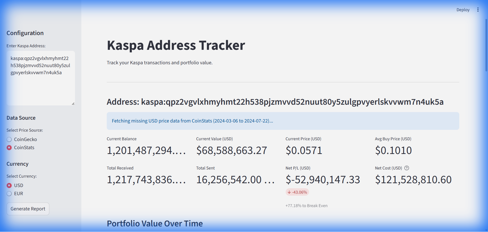
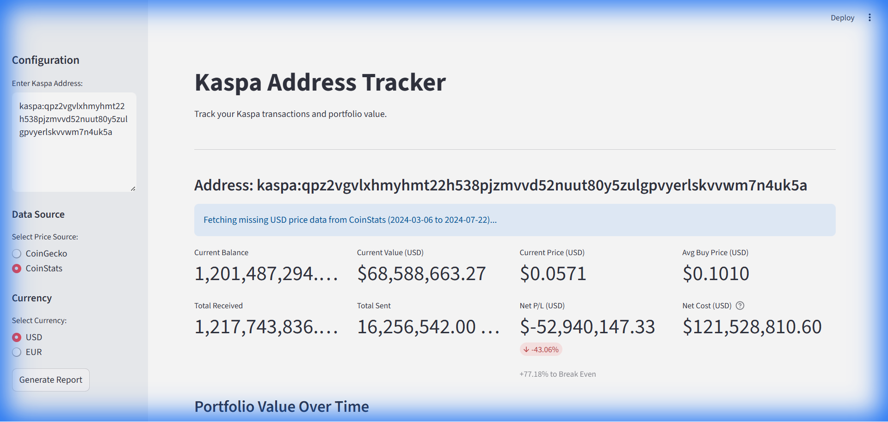
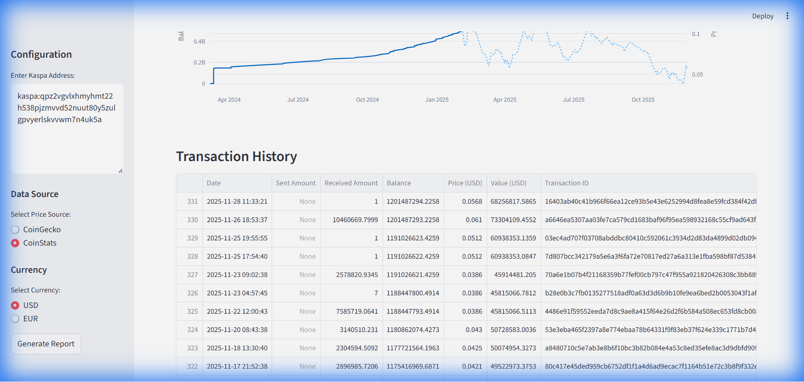

# Kaspa Portfolio Tracker

A real-time portfolio tracking application for Kaspa (KAS) cryptocurrency. Track your wallet balance, transaction history, and portfolio value with live price data.

## What It Does

- **Track Multiple Wallets** - Monitor one or more Kaspa addresses simultaneously
- **Real-Time Valuation** - Live portfolio value in USD or EUR
- **Transaction History** - Complete record of all sends and receives
- **Portfolio Analytics** - Current balance, average buy price, profit/loss, and break-even calculations
- **Interactive Charts** - Visualize portfolio value and balance over time
- **CSV Export** - Download transaction reports for external analysis

## Screenshots


*Portfolio overview with key metrics*


*Historical portfolio value visualization*


*Detailed transaction table*

## Setup

### Prerequisites

- Python 3.10 or higher
- Poetry

### Installation

1. Clone or download this repository

2. Install dependencies:
```powershell
poetry install
```

3. Configure API key:
   - Create `.streamlit/secrets.toml`
   - Add your CoinStats API key:
   ```toml
   COINSTATS_API_KEY = "your_api_key_here"
   ```

### Running the Application

```powershell
python -m poetry run streamlit run app.py
```

The app will open at `http://localhost:8501`

## Usage

1. Enter one or more Kaspa addresses in the sidebar (one per line)
2. Select your preferred currency (USD or EUR)
3. Click "Generate Report"
4. View your portfolio analytics, charts, and transaction history
5. Download CSV reports as needed

## Data Storage

The application uses a SQLite database (`kaspa_data.db`) to cache historical price data, minimizing API calls and improving performance. The database only contains public price information.
